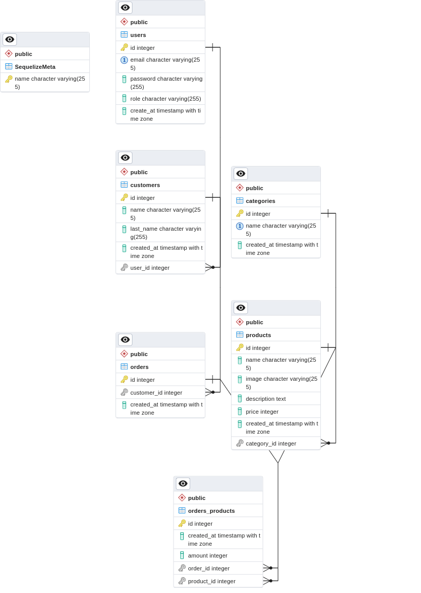

# MY SHOP

MY SHOP is a Restful API that is functional for an online shop. Users can see products, filter them by category, price and name, as well as add products to the shopping cart and place orders. You can also log in as an admin, who can manage the web app, adding categories and products, as well as deleting and updating them, and managing users and customers.

## Built With

- Node.js
- Express
- PostgreSQL
- Docker
- JWT
- Joi
- Sequelize
- Passport
- Bcrypt

## Requirements

To run this project locally, you will need:

- Node.js v14 or later
- Docker
- Postgres

## Getting Started

1. Clone the repository from GitHub:

`git clone https://github.com/williamsch/myshop.git`

2. Install all dependencies:

`npm install`

3. Set up the database with Docker:

`docker-compose up postgres`

4. Run the migrations:

`npx sequelize-cli db:migrate`

5. Use the seed file to populate the database:

`npx sequelize-cli db:seed:all`

6. Copy the environment variables specified in the `.env.example` file and create a new `.env` file in the root directory of the project. Make sure to set the `NODE_ENV` variable to `development`.

7. Start the development server:

`npm run dev`

The app will now be running on `http://localhost:3050`.

## Usage

The API endpoints are documented in the `API.md` file.

## Author

Williams Colmenares

- [LinkedIn](https://www.linkedin.com/in/williamscolmenaresch/)
- [GitHub](https://github.com/williamscch)

## Front-end Repository

The front-end repository for this project can be found at: https://github.com/williamscch/myshop-client

## ERD Diagram

> 

## 🔭 Future Features 

> Describe 1 - 3 features you will add to the project.
- [ ] **[new_feature_1]**
- [ ] **[new_feature_2]**
- [ ] **[new_feature_3]**

## 🤝 Contributing 

Contributions, issues, and feature requests are welcome!

Feel free to check the [issues page](../../issues/).

## 📝 License 

This project is [MIT](./MIT.md) licensed.
